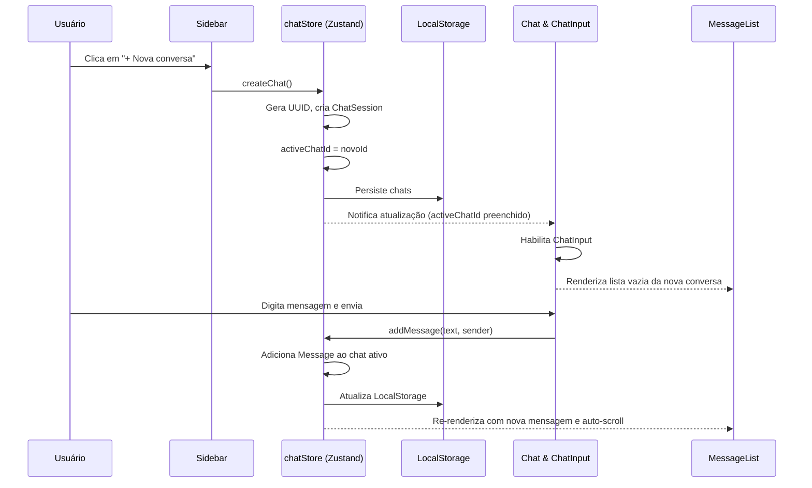

# PRD — Multi-chat com Zustand

## 1. Visão geral

Evolução da aplicação de chat em janela única para suporte a **múltiplas conversas independentes** gerenciadas globalmente com a biblioteca **Zustand** e persistidas no `localStorage`.

A interface passa a contar com uma **barra lateral (sidebar)** para listagem e criação de conversas, com comportamento responsivo (retrátil em dispositivos móveis via menu hambúrguer e fixa em desktop). Ao abrir a aplicação, nenhuma conversa estará selecionada por padrão (*empty state* inicial com input desabilitado).

**Stack:** Vite + React 19 + TypeScript + Tailwind CSS + Zustand.

---

## 2. Objetivos

| Objetivo | Critério de sucesso |
|---|---|
| Múltiplas conversas | O usuário pode criar e alternar entre diferentes chats mantendo o histórico de mensagens isolado por conversa |
| Gerenciamento global com Zustand | Centralização do estado de conversas e do chat ativo em uma store em `src/stores/` |
| Persistência local | Histórico de conversas preservado no navegador via `localStorage` (middleware `persist` do Zustand) |
| Empty state inicial | Ao carregar a página, nenhuma conversa está ativa e a área de input fica bloqueada e com 50% de opacidade |
| Sidebar responsiva | Barra lateral fixa no desktop e retrátil (drawer com botão hambúrguer) em dispositivos móveis |
| Identificação simplificada | Cada conversa é identificada no sidebar por um identificador encurtado (prefixo `#` + 8 caracteres) |

---

## 3. Fora de escopo

- Exclusão ou renomeação de conversas.
- Edição ou exclusão de mensagens individuais.
- Busca ou filtro de mensagens/conversas.
- Título customizado ou resumo automático da conversa por IA.
- Backend, banco de dados remoto ou sincronização em nuvem.
- Anexos, mídias ou formatação Markdown (mantém-se texto plano).

---

## 4. Convenções técnicas

| Regra | Detalhe |
|---|---|
| Tipos | `type` (não `interface`) em `src/types/` |
| Store Zustand | `src/stores/chatStore.ts` usando Zustand + middleware `persist` |
| Componentes | `src/components/` (ex.: `Sidebar.tsx`, `Chat.tsx`) |
| Estilização | Tailwind CSS exclusivamente |
| Ícones | Emojis / SVG sem dependências externas adicionais |
| Lint | `oxlint` (já configurado no projeto) |
| Nova dependência | `zustand` adicionado via gerenciador de pacotes |

---

## 5. Modelo de dados

### `src/types/message.ts` (já existente)
```ts
export type Sender = 'user' | 'robot'

export type Message = {
  id: string
  text: string
  sender: Sender
}
```

### `src/types/chat.ts` (atualização / novo contrato)
```ts
import type { Message, Sender } from './message'

export type ChatId = string

export type ChatSession = {
  id: ChatId
  messages: Message[]
  createdAt: number
}

export type ChatState = {
  chats: Record<ChatId, ChatSession>
  chatOrder: ChatId[]
  activeChatId: ChatId | null
}

export type ChatActions = {
  createChat: () => string
  selectChat: (id: ChatId) => void
  addMessage: (text: string, sender: Sender) => void
}

export type ChatStore = ChatState & ChatActions
```

---

## 6. Requisitos funcionais

### RF-01 — Criação de conversas
- Um botão com destaque visual **"+ Nova conversa"** no topo da sidebar.
- Ao clicar no botão:
  - Gera um identificador único (UUID via `crypto.randomUUID()`).
  - Cria uma nova sessão com lista de mensagens vazia e data de criação.
  - Adiciona o ID ao início da ordenação (`chatOrder`).
  - Define a conversa criada imediatamente como a conversa ativa (`activeChatId = novoId`).
  - Se estiver em dispositivo móvel, fecha automaticamente o drawer da sidebar.

### RF-02 — Listagem e seleção de conversas
- A sidebar renderiza a lista de conversas existentes ordenadas cronologicamente (da mais recente para a mais antiga).
- Cada item da lista exibe o identificador encurtado (ex.: `#a1b2c3d4`, baseado nos primeiros 8 caracteres do UUID).
- O item correspondente à conversa ativa (`activeChatId`) recebe destaque visual (cor de fundo e borda diferenciada).
- Ao clicar em um item da lista:
  - A conversa correspondente torna-se a conversa ativa (`activeChatId`).
  - As mensagens dessa conversa são carregadas no painel principal.
  - Se estiver em dispositivo móvel, fecha automaticamente o drawer da sidebar.

### RF-03 — Estado inicial e controle do input (Empty State)
- Ao abrir o site pela primeira vez ou recarregar a página, nenhuma conversa estará ativa (`activeChatId: null`).
- Quando `activeChatId === null`:
  - **Área central:** exibe mensagem explicativa: *"Nenhuma conversa selecionada. Crie uma nova conversa ou selecione uma na barra lateral para começar."*
  - **Card de input:** fica desabilitado com **50% de opacidade** (`opacity-50`), `cursor-not-allowed` e eventos bloqueados (botões e textarea desativados).
- Quando uma conversa estiver ativa:
  - Se a conversa não contiver mensagens: exibe a mensagem de conversa vazia (*"Nenhuma mensagem ainda. Envie a primeira!"*).
  - O card de input é habilitado normalmente para digitação e envio.

### RF-04 — Envio de mensagens no chat ativo
- As mensagens enviadas são adicionadas exclusivamente ao histórico da conversa ativa (`chats[activeChatId].messages`).
- O comportamento do remetente (usuário alinhado à direita / robô à esquerda com borda roxa) mantém-se idêntico ao PRD base.
- Auto-scroll rola automaticamente para o final da lista ao receber uma nova mensagem ou ao alternar entre conversas.

### RF-05 — Persistência no LocalStorage
- O estado das conversas (`chats` e `chatOrder`) é persistido automaticamente via middleware `persist` do Zustand na chave `chat-storage`.
- O `activeChatId` **não** é restaurado como ativo ao recarregar a página, garantindo o requisito de inicialização em *empty state* (`activeChatId: null`).

### RF-06 — Sidebar responsiva (Mobile vs Desktop)
- **Desktop (`lg` ou `>= 1024px`):**
  - A barra lateral fica permanentemente visível, fixada à esquerda com largura definida (ex.: `w-72`).
- **Mobile (`< 1024px`):**
  - A barra lateral inicia oculta.
  - Um botão hambúrguer (`☰`) fixo no canto superior esquerdo permite abrir a sidebar como um drawer deslizante (*slide-in*).
  - Um backdrop escurecido cobre o fundo enquanto o drawer estiver aberto; clicar no backdrop fecha o menu.
  - Botão de fechar (`✕`) visível no topo do drawer.
  - Ao selecionar ou criar uma conversa, o drawer se fecha automaticamente.

---

## 7. Requisitos visuais e de layout

### Layout Desktop (`lg:flex`)
```
┌──────────────┬─────────────────────────────────────────────┐
│ SIDEBAR      │  ÁREA PRINCIPAL (fundo stone-200)           │
│              │                                             │
│ [+ Nova Conv]│     ┌─────────────────────────────┐         │
│              │     │  max-w-2xl centralizado     │         │
│ Conversas:   │     │                             │         │
│ • #a1b2c3d4* │     │  [empty state / histórico]  │         │
│ • #e8f901ab  │     │                             │         │
│ • #45bc12de  │     │  ┌───────────────────────┐  │         │
│              │     │  │ [toggle] [textarea] [▶]│  │ ← fixo │
│              │     │  └───────────────────────┘  │         │
│              │     └─────────────────────────────┘         │
└──────────────┴─────────────────────────────────────────────┘
* item ativo destacado
```

### Layout Mobile (`< 1024px`)
```
┌─────────────────────────────────────────────┐
│ [☰]                                         │
│                                             │
│     ┌─────────────────────────────┐         │
│     │  max-w-2xl centralizado     │         │
│     │                             │         │
│     │  [empty state / histórico]  │         │
│     │                             │         │
│     │  ┌───────────────────────┐  │         │
│     │  │ [toggle] [textarea] [▶]│  │ ← fixo │
│     │  └───────────────────────┘  │         │
│     └─────────────────────────────┘         │
└─────────────────────────────────────────────┘
  (Ao tocar em [☰], drawer desliza da esquerda com backdrop)
```

| Elemento | Especificação visual |
|---|---|
| Sidebar (Desktop) | Fundo `bg-stone-100`, borda direita `border-r border-stone-300`, `w-72`, altura total |
| Sidebar (Mobile drawer) | `fixed inset-y-0 left-0 z-50 w-72 bg-stone-100 shadow-2xl transition-transform` |
| Backdrop móvel | `fixed inset-0 z-40 bg-black/40` |
| Botão hambúrguer | `fixed top-4 left-4 z-30 p-2 rounded-lg bg-white shadow-md text-stone-700` |
| Botão Nova Conversa | `w-full bg-stone-900 text-white font-medium py-2.5 px-4 rounded-xl hover:opacity-90 transition` |
| Item de conversa (normal) | `text-stone-700 hover:bg-stone-200 rounded-lg px-3 py-2 text-sm font-mono` |
| Item de conversa (ativo) | `bg-white text-stone-950 font-semibold shadow-sm border border-stone-200` |
| Input desabilitado | `opacity-50 pointer-events-none` ou campos com atributo `disabled` |

---

## 8. Arquitetura de componentes e estado

```
src/
├── types/
│   ├── message.ts            # Sender, Message
│   └── chat.ts               # ChatId, ChatSession, ChatStore
├── stores/
│   └── chatStore.ts          # Zustand store com persist
├── components/
│   ├── Sidebar.tsx           # Lista de chats, botão novo chat, drawer mobile
│   ├── Chat.tsx              # Orquestrador principal: Sidebar + área de mensagens
│   ├── MessageList.tsx       # Mensagens da conversa ativa ou empty states
│   ├── MessageBubble.tsx     # Bolha individual de mensagem
│   ├── ChatInput.tsx         # Card fixo: toggle + textarea + botão enviar
│   └── SenderToggle.tsx      # Botão ícone usuário / robô
├── App.tsx                   # Renderiza <Chat />
└── index.css                 # Tailwind CSS
```

### Responsabilidades

| Componente / Módulo | Responsabilidade |
|---|---|
| `chatStore` | Gerencia dicionário de chats, ordem, ID ativo, persistência no localStorage e ações (`createChat`, `selectChat`, `addMessage`) |
| `Sidebar` | Renderiza drawer móvel ou coluna fixa, botão "+ Nova conversa", lista de chats com IDs encurtados |
| `Chat` | Layout mestre (`flex`), gerencia abertura do drawer mobile, conecta store ao `MessageList` e `ChatInput` |
| `MessageList` | Exibe mensagens do `activeChatId` ou empty state (nenhum chat ativo vs chat sem mensagens) |
| `ChatInput` | Controla estado do rascunho, bloqueia quando `activeChatId === null`, envia mensagem via store |

---

## 9. Fluxo de dados



---

## 10. Tarefas de implementação (ordem progressiva)

### Fase 1 — Dependência e Store Zustand

#### Tarefa 1.1 — Instalar Zustand e definir contratos de tipos
- [x] Instalar o pacote `zustand` no projeto (`npm install zustand`).
- [x] Atualizar `src/types/chat.ts` com as tipagens da store e sessões (`ChatSession`, `ChatState`, `ChatActions`, `ChatStore`).
- **Verificação:** compilação TypeScript limpa com `npm run build`.

#### Tarefa 1.2 — Implementar Store Zustand com Persist
- [x] Criar `src/stores/chatStore.ts`.
- [x] Configurar middleware `persist` com a chave `'chat-storage'`.
- [x] Implementar `partialize` para salvar `chats` e `chatOrder`, mantendo `activeChatId: null` ao inicializar.
- [x] Implementar `createChat`: gera UUID, adiciona sessão, define `activeChatId` e retorna o novo ID.
- [x] Implementar `selectChat`: define `activeChatId`.
- [x] Implementar `addMessage`: insere mensagem no chat ativo.
- **Verificação:** testes manuais no console ou componente temporário confirmando gravação no `localStorage`.

---

### Fase 2 — Componente Sidebar e Responsividade

#### Tarefa 2.1 — Componente de lista e botão de criação
- [x] Criar `src/components/Sidebar.tsx`.
- [x] Incluir botão "+ Nova conversa" conectado à action `createChat`.
- [x] Listar conversas a partir de `chatOrder`, exibindo o ID truncado (`#` + primeiros 8 caracteres).
- [x] Destacar visualmente a conversa ativa (`activeChatId`).
- [x] Conectar clique da conversa à action `selectChat`.
- **Verificação:** sidebar renderiza a lista de conversas criadas e permite alternar entre elas.

#### Tarefa 2.2 — Layout responsivo (Drawer Mobile e Hambúrguer)
- [x] Adicionar botão hambúrguer no topo esquerdo visível em telas menores que `lg`.
- [x] Implementar abertura/fechamento do drawer da sidebar com backdrop semitransparente.
- [x] Fechar o drawer automaticamente ao selecionar uma conversa ou ao criar uma nova.
- [x] Configurar layout desktop com sidebar estática e painel principal flexível (`flex h-screen`).
- **Verificação:** visualização e uso fluido tanto em viewport mobile quanto em desktop.

---

### Fase 3 — Integração do Chat e Empty States

#### Tarefa 3.1 — Desativação do Input quando sem conversa ativa
- [x] Atualizar `src/components/ChatInput.tsx` para receber prop `disabled` (ou obter da store).
- [x] Aplicar classes de opacidade reduzida (`opacity-50`), `cursor-not-allowed` e desabilitar `textarea`, `SenderToggle` e botão Enviar quando desabilitado.
- [x] Ajustar placeholder para *"Selecione ou crie uma conversa para digitar..."* quando desabilitado.
- **Verificação:** ao carregar a página inicial sem conversa ativa, o input é exibido bloqueado e esmaecido.

#### Tarefa 3.2 — Ajuste dos Empty States em MessageList
- [x] Atualizar `src/components/MessageList.tsx` para tratar dois estados vazios:
  1. `activeChatId === null`: exibir *"Nenhuma conversa selecionada. Crie uma nova conversa ou selecione uma na barra lateral para começar."*
  2. `activeChatId !== null` mas sem mensagens: exibir *"Nenhuma mensagem ainda. Envie a primeira!"*
- [x] Garantir auto-scroll para a última mensagem ao trocar de conversa ativa ou ao receber nova mensagem.
- **Verificação:** mensagens de empty state corretas para cada cenário.

#### Tarefa 3.3 — Integração completa no componente Chat
- [x] Conectar `src/components/Chat.tsx` à store Zustand.
- [x] Integrar `Sidebar`, `MessageList` e `ChatInput`.
- [x] Remover estados locais obsoletos (`messages` em `useState`).
- **Verificação:** envio de mensagens funcionando dentro da conversa ativa selecionada.

---

### Fase 4 — Testes, Polimento e Validação

#### Tarefa 4.1 — Verificação de persistência e recarregamento
- [ ] Criar 3 conversas com mensagens distintas em cada uma.
- [ ] Recarregar a página (F5):
  - Verificar se a aplicação inicia com `activeChatId: null` (empty state e input desabilitado).
  - Verificar se as 3 conversas permanecem listadas no sidebar com seus respectivos históricos preservados.
  - Clicar em cada conversa e confirmar se as mensagens corretas são restauradas.
- **Verificação:** persistência íntegra sem vazamento de mensagens entre chats.

#### Tarefa 4.2 — Qualidade de código e build
- [ ] Executar `npm run lint` (`oxlint`) e resolver eventuais avisos.
- [ ] Executar `npm run build` para garantir conformidade estrita do TypeScript e empacotamento Vite.
- **Verificação:** build e lint passam com 0 erros.

---

## 11. Referência rápida de decisões

| Decisão | Escolha definida |
|---|---|
| Gerenciador de estado | Zustand em `src/stores/chatStore.ts` |
| Persistência | `localStorage` via middleware `persist` |
| Estado ao abrir o site | Nenhuma conversa selecionada (`activeChatId: null`), input desabilitado |
| Identificador da conversa | ID encurtado: `#` + 8 primeiros caracteres do UUID |
| Exclusão de conversas | Fora de escopo nesta versão |
| Seleção pós-criação | Conversa recém-criada torna-se ativa automaticamente |
| Comportamento mobile | Drawer retrátil com hambúrguer, fecha ao selecionar/criar conversa |
| Layout desktop | Sidebar fixa à esquerda |

---

## 12. Critérios de aceite (checklist final)

- [x] Instalação e configuração do Zustand com TypeScript.
- [x] Store criada em `src/stores/chatStore.ts` com actions de criar, selecionar e enviar mensagem.
- [x] Conversas e mensagens persistidas no `localStorage`.
- [x] Ao abrir/recarregar a página, a aplicação inicia em estado vazio (nenhum chat selecionado).
- [x] Input desabilitado (opacidade 50% e controles inoperantes) quando não há chat selecionado.
- [x] Mensagem de orientação no centro da tela quando não há chat ativo.
- [x] Sidebar com botão de "+ Nova conversa" e lista de chats existentes.
- [x] Identificador exibido na sidebar no formato encurtado (`#xxxxxxxx`).
- [x] Alternância entre conversas restaura o histórico específico de cada uma.
- [ ] Drawer retrátil no mobile acionado por botão hambúrguer no canto superior esquerdo.
- [ ] Fechamento automático do menu mobile ao criar ou selecionar conversa.
- [ ] `npm run lint` e `npm run build` executam sem erros.

